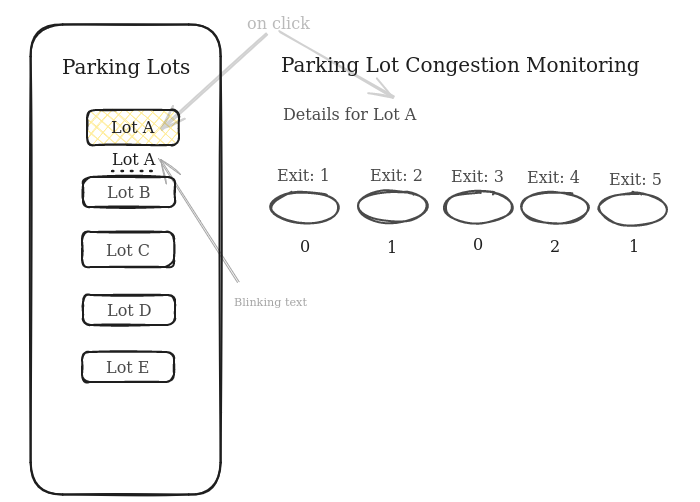
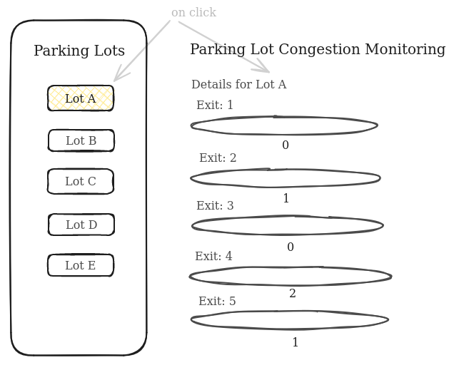
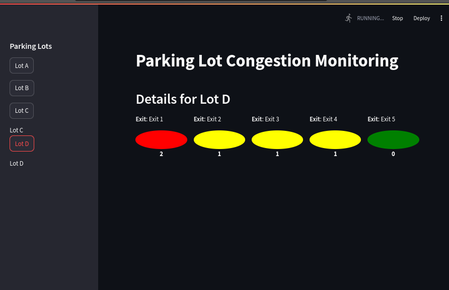

# Parkig Lot Congestion Monitoring Interface (Version 0.1)


### Overview (to be changed)
### Overview
The Parking Lot Congestion Monitoring Interface is designed to provide real-time monitoring of congestion levels at various exits of a parking lot. The interface displays congestion severity in a visually intuitive way, using color-coding and alerts to ensure that users can quickly identify and address areas of concern.


### Product Vision

The goal is to deliver a reliable and user-friendly interface that enables efficient monitoring of parking lot congestion. The system should provide clear and actionable insights, allowing users to manage traffic flow effectively and minimize delays.

### User Stories & Use Cases

- **As a Parking Lot Manager**, I want to monitor the congestion levels at each exit in real-time so that I can take timely actions to alleviate traffic.
- **As a System Administrator**, I want to configure and manage the parking lots being monitored so that the data is accurate and up-to-date.

#### Use Cases:
1. **Monitor Congestion**: The user selects a parking lot to view the congestion status of its exits.
2. **Alert on High Congestion**: The system highlights exits experiencing severe congestion.
3. **Data Refresh**: The system periodically updates the congestion data to ensure accuracy.


### Requirements

#### Functional Requirements:
- The system shall allow users to view real-time congestion levels at all parking lot exits.
- The system shall alert users when severe congestion occurs at any exit.
- The system shall refresh congestion data every 10 seconds.

#### Non-functional Requirements:
- The system shall be responsive and accessible on various device screen sizes.
- The system shall handle up to 1,000 concurrent users without performance degradation.

#### Dependencies:
- The system depends on real-time traffic data inputs for accurate congestion monitoring.


### Design principles

#### User Experience (UX)

#### Technical Design

##### System Architecture Overview
The system is designed with a modular architecture to separate concerns and enhance maintainability. It includes components for data generation, storage, and user interface presentation.

1) **Diagrams:**

   - **Use Case Diagram:** Illustrates the interactions between users and the system.

   


   - **Activity Diagram:** Shows the sequence of operations within the system.

   - **Class Diagram:** This diagram represents the key components of the system in a more abstract way.

      

   - **Sequence Diagram:** Displays the flow of operations when a user interacts with the system.

    

   - **State Diagram:** Illustrates the different states of the system and transitions between them.


   - **Component Diagram:** Depicts the system's components and their interactions.

   - **Deployment Diagram:** Shows the physical deployment of components across hardware nodes.

   - **Entity-Relationship Diagram (ERD):** This Entity-Relationship Diagram models the database structure for the system. it visualizes the data model, including entities and relationships.

    


   
   - **Flowchart:** Provides a simplified view of the system's logic and decision points.

2) **Data Flow:**
   - The system periodically generates congestion data based on the real-time data flow.
   - Data is stored and retrieved to ensure consistency and availability during user interactions.

   


3) **Component Interactions:**
   - Data generation, storage, and user interface components interact to ensure real-time updates and accuracy in displayed congestion levels.

   


#### Wireframes/Mockups



This wireframe visualizes how exits and their severity levels are represented in a grid layout.

##### Sidebar
######  Parking Lots
The side bar lists all monitored parking lots, each parking lot is dispalayed as a button element that users can click to monitor congestion details for that specific lot. If severe congestion is experienced in one of the exits (severity level 2), the parking lot element on the sidebar would blink to draw attention to it.


#### Main area
###### Congestion Details

When a parking lot is selected from the sidebar, the main area displays all its exits along with their relevant color-coded severity level.  Each exit's severity is represented by a colored-circle and a severity digit to reflect the conegstion status.
Exits and their severity levels are represented in a grid layout, making it easy for users to compare congestion across different exits at glance.

ls

###### Responsive Design

The interface is designed to adapt seamlessly to different screen sizes, ensuring that users can monitor congestion effectively on any device.



###### Severity Visualization

- Low Severity (0): represented by a green circle, indicating that the exit is operating smoothly with minimal or no conegstion.
- Medium Severity (1): reperesented by a yellow circle, suggesting moderate congestion that may require monitoring but is not critical.
- High severity (2): represented by a red circle, indicating severe congestion that might need instant action to prevent congestions and delays.
(The red color is accompanied by a blinking effect on its corresponding parking lot on the sidebar.)

| Severity level    | Repersenting digit | Color    |
| ----------------  | ------------------ | -------- |
| Low severity      | 0                  | Green    |
| Medium severity   | 1                  | Yellow   |
| High severity     | 2                  | Red      | 


### Development Plan

#### Technology Stack
The final product uses XYZ technologies to achieve the desired functionality.

#### Development Timeline
(A structured timeline outlining the phases of development, testing, and deployment.)
#### Risk Management
( Identification of potential risks and mitigation strategies to ensure successful project delivery.)

### Testing and Quality Assurance


#### Testing Strategy
(Unit tests, integration tests, and end-to-end tests ensure system reliability.)

#### Metrics

(Define key performance indicators (KPIs) to measure system performance and usability.)

### Launch Plan
(Outline the steps for deploying the system to production.)

#### Deployment Strategy
(Establish monitoring tools and processes to ensure system health post-launch.)
#### Monitoring


### Final User Interface (Demo)

The demo section includes screenshots and descriptions of the final user interface, implemented using streamlit and Kafka technologies.
The following screenshot showcases the fully implemented Parking Lot Congestion Monitoring interface with color-coded severity levels as described in the documentation.




In this final version, the color coding visually represents the congestion severity:
- **Green:** Low severity (0)
- **Yellow:** Medium severity (1)
- **Red:** High severity (2)

The blinking effect for high severity (red) is also visible in the sidebar, highlighting parking lots experiencing severe congestion (Lots C and D).


#### Data handling

###### Simulation Data
-  Data Generation: The application generates random test/simulation data, this data assigns severity levels (0,1 and 2) to every exit within a parking lot to mimic real-world congestion.

- Severity Distribution: We set predefined probabilities to generate severity levels, with low and medium (0,1) severity having a 45% chance of occurance, and high severity (2) with 10%. As severe congestion is less-common in real-world but still likely to happen. 

###### Session State:

- Data Storage: The congestion data is stored in the streamlit session state to maintain data persistence independently from user interactions.

- Refresh Logic: To  ensure that the user sees the most updated data, the application checks the time since the last data refresh and regenerates the congestion data each 10 secs. 
This interval is focused on keeping the backend data (i.e., the simulation data) fresh. The application checks if 10 seconds have passed since the last data generation and, if so, regenerates the data. This ensures that the data is always recent whenever the UI needs to display it, but it doesn't force an immediate update to the UI.

#### Session State:

###### Blinking Effect

- CSS Animation: The blinking effect is done using a CSS animation defined in the get_blinking_style() function. The animation toggles the opacity of the blinking text from fully visible to invisible in a loop, creating a blinking effect.

###### Refresh and Rerun

This interval controls how often the entire app interface is refreshed and rerun. We set a 30-second interval for updating the UI, giving users enough time to view the current data before it refreshes.
This refreshes the user interface, updating what the user sees based on the latest data. It ensures that the displayed information is periodically updated, providing the most recent congestion status without the user needing to refresh the page manually.

#### How to Run Locally

1. Install Dependencies
```
pip install -r requirements.txt

```
2. Run the Streamlit App:
```
streamlit run conges-notif-ui.py
```
3. Access the App
Open your web browser and navigate to http://localhost:8501 to view the application.

# Author and Date

**Author:** Sarah Nadi  
**Date:** [Aug 21, 2024]