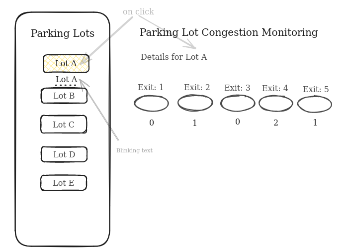
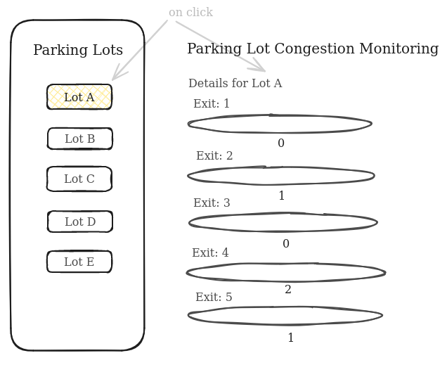
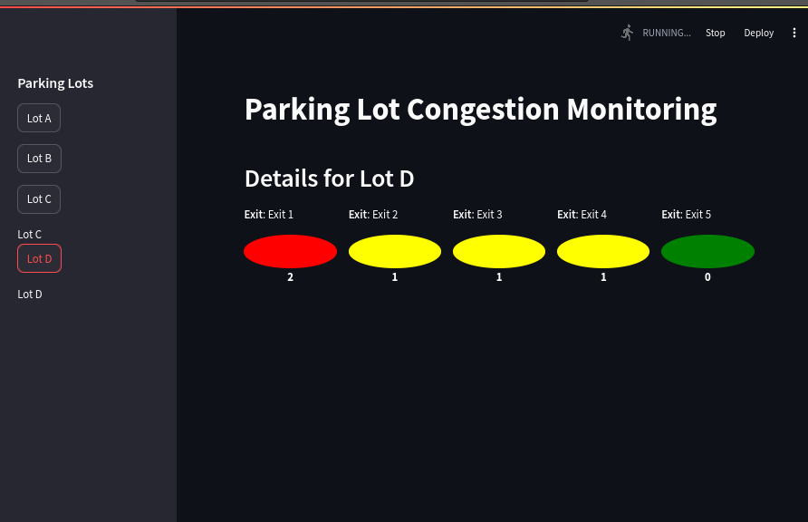

# Parkig Lot Congestion Monitoring Interface (Version 0.1)
## Overview
The application UI serves for real-time congestion monitoring in various parking lots by displaying the congestion severity at different exits of a specific parking lot. The degree of severity is color-coded and a blinking text effect is used to notify the presence of a severe congestion, which ensures that users can quickly identify and respond to areas of concern in any parking lot.



This wireframe visualizes how exits and their severity levels are represented in a grid layout.

## Sidebar
###  Parking Lots
The side bar lists all monitored parking lots, each parking lot is dispalayed as a button element that users can click to monitor congestion details for that specific lot. If severe congestion is experienced in one of the exits (severity level 2), the parking lot element on the sidebar would blink to draw attention to it.


## Main area
### Congestion Details

When a parking lot is selected from the sidebar, the main area displays all its exits along with their relevant color-coded severity level.  Each exit's severity is represented by a colored-circle and a severity digit to reflect the conegstion status.
Exits and their severity levels are represented in a grid layout, making it easy for users to compare congestion across different exits at glance.


### Responsive Design

The interface is designed to adapt seamlessly to different screen sizes, ensuring that users can monitor congestion effectively on any device.



### Severity Visualization

- Low Severity (0): represented by a green circle, indicating that the exit is operating smoothly with minimal or no conegstion.
- Medium Severity (1): reperesented by a yellow circle, suggesting moderate congestion that may require monitoring but is not critical.
- High severity (2): represented by a red circle, indicating severe congestion that might need instant action to prevent congestions and delays.
(The red color is accompanied by a blinking effect on its corresponding parking lot on the sidebar.)

| Severity level    | Repersenting digit | Color    |
| ----------------  | ------------------ | -------- |
| Low severity      | 0                  | Green    |
| Medium severity   | 1                  | Yellow   |
| High severity     | 2                  | Red      | 

### Final User Interface

The following screenshot showcases the fully implemented Parking Lot Congestion Monitoring interface with color-coded severity levels as described in the documentation.



In this final version, the color coding visually represents the congestion severity:
- **Green:** Low severity (0)
- **Yellow:** Medium severity (1)
- **Red:** High severity (2)

The blinking effect for high severity (red) is also visible in the sidebar, highlighting parking lots experiencing severe congestion (Lots C and D).


## Data handling

### Simulation Data
-  Data Generation: The application generates random test/simulation data, this data assigns severity levels (0,1 and 2) to every exit within a parking lot to mimic real-world congestion.

- Severity Distribution: We set predefined probabilities to generate severity levels, with low and medium (0,1) severity having a 45% chance of occurance, and high severity (2) with 10%. As severe congestion is less-common in real-world but still likely to happen. 

### Session State:

- Data Storage: The congestion data is stored in the streamlit session state to maintain data persistence independently from user interactions.

- Refresh Logic: To  ensure that the user sees the most updated data, the application checks the time since the last data refresh and regenerates the congestion data each 10 secs. 
This interval is focused on keeping the backend data (i.e., the simulation data) fresh. The application checks if 10 seconds have passed since the last data generation and, if so, regenerates the data. This ensures that the data is always recent whenever the UI needs to display it, but it doesn't force an immediate update to the UI.

## Session State:

### Blinking Effect

- CSS Animation: The blinking effect is done using a CSS animation defined in the get_blinking_style() function. The animation toggles the opacity of the blinking text from fully visible to invisible in a loop, creating a blinking effect.

### Refresh and Rerun

This interval controls how often the entire app interface is refreshed and rerun. We set a 30-second interval for updating the UI, giving users enough time to view the current data before it refreshes.
This refreshes the user interface, updating what the user sees based on the latest data. It ensures that the displayed information is periodically updated, providing the most recent congestion status without the user needing to refresh the page manually.

## How to Run Locally

1. Install Dependencies
```
pip install -r requirements.txt

```
2. Run the Streamlit App:
```
streamlit run conges-notif-ui.py
```
3. Access the App
Open your web browser and navigate to http://localhost:8501 to view the application.

# Author and Date

**Author:** Sarah Nadi  
**Date:** [Aug 21, 2024]